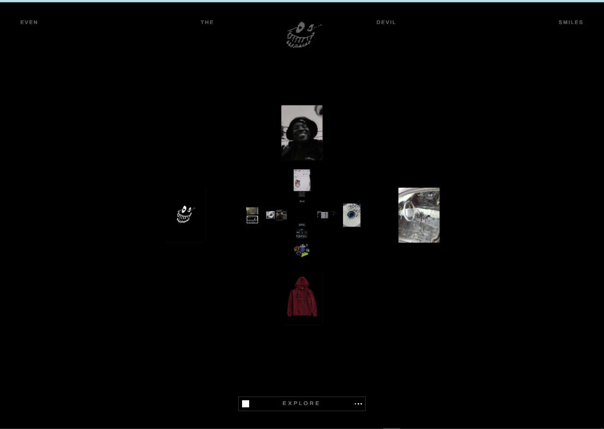

# 🌀 Infinite 3D Tunnel | GSAP & React



## 🔗 Live Demo
Check out the live project here: [https://3d-gsap-slider.vercel.app/](https://3d-gsap-slider.vercel.app/)

## 🚀 Overview
A world-class, high-performance **Infinite 3D Tunnel Image Slider** built with **React**, **GSAP**, and **Tailwind CSS**. This project features a deep perspective "dig" effect, placing images in a cross-pattern elliptical geometry that loops infinitely as the user scrolls.

Designed for high-end portfolios and immersive web experiences, it combines imperative DOM performance with React's component-based architecture.

---

## ✨ Key Features
- **♾️ Infinite Loop Logic**: Seamlessly wraps images in a 3D space for an endless scrolling experience.
- **🌀 3D Elliptical Tunnel**: Images are positioned in a cross-pattern using complex trigonometry for a stunning spatial distribution.
- **⚡ High-Performance GSAP Ticker**: Uses the GSAP ticker for frame-perfect animations and smooth "lerp" (Linear Interpolation) physics.
- **📱 Responsive Design**: Dynamic scaling logic (scale factors) ensures the tunnel feels massive on desktop and perfectly tuned for mobile.
- **⌨️ Multi-Input Control**: Smooth navigation via **Mouse Wheel**, **Keyboard Arrows**, and on-screen controls.
- **🎨 Modern Aesthetics**: Glassmorphic UI elements, custom typography (Outfit, Archivo, Alegreya), and radial lighting effects.

---

## 🛠️ Tech Stack
| Category | Technology |
| :--- | :--- |
| **Core** | [React](https://reactjs.org/) |
| **Animation** | [GSAP (GreenSock Animation Platform)](https://greensock.com/gsap/) |
| **Styling** | [Tailwind CSS v4](https://tailwindcss.com/) |
| **Build Tool** | [Vite](https://vitejs.dev/) |
| **Icons** | SVG / Custom CSS |

---

## 📂 Project Structure
```bash
├── public/
│   ├── images/       # Tunnel Assets
│   └── doc/          # Documentation Images
├── src/
│   ├── components/
│   │   ├── Slider.jsx      # Core 3D Logic
│   │   ├── TopNav.jsx      # Immersive Header
│   │   └── BottomNav.jsx   # Interactive Footer
│   ├── data/
│   │   └── images.json     # Dynamic Image Configuration
│   ├── index.css           # Tailwind & 3D Layer Styling
│   └── App.jsx             # Application Shell
```

---

## 🚀 Getting Started

### 1. Clone the repository
```bash
git clone https://github.com/hey-Zayn/GSAP-3D-image-slider.git
```

### 2. Install dependencies
```bash
npm install
```

### 3. Run the development server
```bash
npm run dev
```

---

## ⚙️ Configuration
You can easily customize the tunnel behavior in `src/components/Slider.jsx`:

```javascript
const CONFIG = {
  totalImages: 18,
  scrollSpeed: 2.5,
  layerGap: 5000,    // Z-distance between layers
  lerp: 0.07,         // Smoothing factor
  buttonScrollAmount: 2500,
};
```

To update the images, simply modify `src/data/images.json` and place your files in `/public/images/`.

---

## 📄 License
Distributed under the MIT License. See `LICENSE` for more information.

---

## 🤝 Contributing
Contributions are what make the open-source community such an amazing place to learn, inspire, and create. Any contributions you make are **greatly appreciated**.

1. Fork the Project
2. Create your Feature Branch (`git checkout -b feature/AmazingFeature`)
3. Commit your Changes (`git commit -m 'Add some AmazingFeature'`)
4. Push to the Branch (`git push origin feature/AmazingFeature`)
5. Open a Pull Request

---

<p align="center">
  Built with ❤️ by Zayn
</p>
